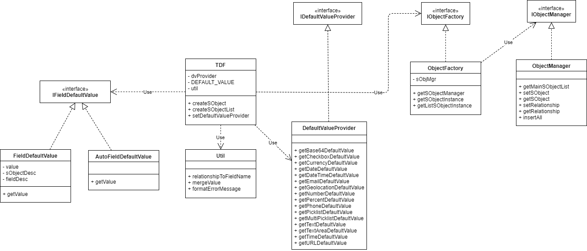

## Core concepts 

Overview

Test Data Factory contains the following classes 

| Class name               | Description                                            |
|--------------------------|--------------------------------------------------------|
| **TDF**                  | The containing class                                   |
| **ObjectFactory**        | Instantiate the sObject and all the related sObjects   |
| **ObjectManager**        | Contains all the sObjects instances, insert all method |
| **DefaultValueProvider** | Provide all default field values                       |
| **Util**                 | Contains utility methods                               |

